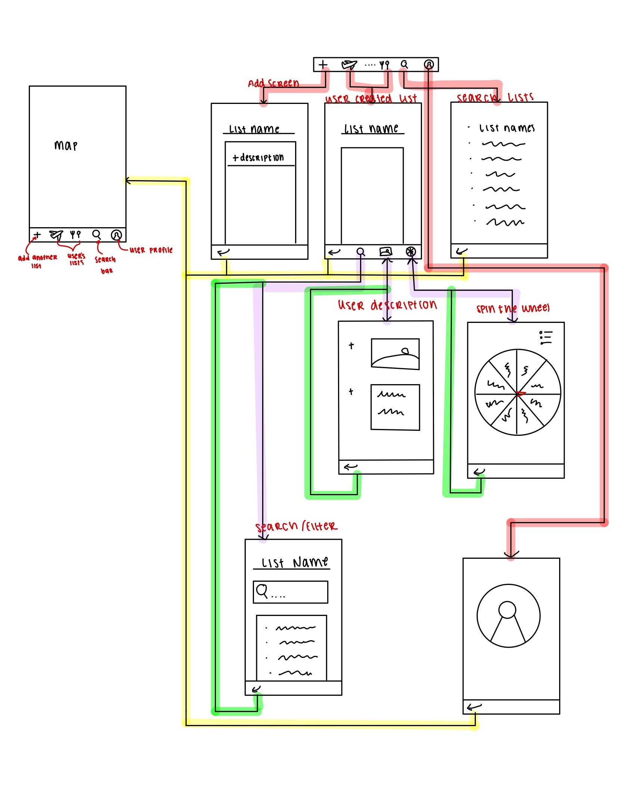

# WanderWise

## Table of Contents

1. [Overview](#Overview)
2. [Product Spec](#Product-Spec)
3. [Wireframes](#Wireframes)
4. [Schema](#Schema)

## Overview

### Description

App that allows you to curate lists on maps and save their location. Users will be able to look up specific restaurants or keywords within the list as well as add photos/description about each place that they've visted. Users will also be able to 'spin a wheel' to help them decide where to go/eat if they're indecisive. A filter system will be available to help the user refine their search

### App Evaluation

[Evaluation of your app across the following attributes]
* **Mobile**:
    * Links the **location** of the place the person wants to go to
        * maybe integrate a **map** to it/move into another maps app
    * **Camera**: Can add photos of the food/drinks that the user got there
* **Story**:
    * Friends with respond well to this product idea
        * Google Maps has the same concept where you can add places to the map, however, there's no way filter look up places from the list
            * problematic when the list gets too large
        * Can keep track of where users have visited + any additional notes and photos
    * Value(?): Organization
        * Does not necessarily have to apply to just food
        * Can have multiple lists
            * travel
            * tourist
            * food
* **Market**:
    * Potential User base: Foodies, Travellers, anyone who wants to keep track of certain location
        * can expand to include extended family/friends of the user if they want to share it
    * Provides values for foodies/travellers
        * People who save ideas of what to do/eat but cannot think of it in the moment
    * Value for indecisive eaters
        * Spin the wheel to help decide
* **Habit**:
    * Usage: on and off basis
        * whenever person wants to add a location
        * whenever a person is looking for a place to go to
        * Usage isn't necessarily daily
    * Average user creates on the app
        * Creates their own lists
        * adds their own photos/thoughts
* **Scope**:
    * Difficult if want to integrate a live map into the interface
        * Have to figure out how to filter
    * How to add in user's personal photos 
    * Stripped down version:
        * no map interface
        * no filteration system
            * Can only really search up the restaurant in mind
    * Clearly defined: Kind of

## Product Spec

### 1. User Stories (Required and Optional)

**Required Must-have Stories**

* User can create a list
  * Add a name and description to list
  * Add location links to the list
* User can search within the list

**Optional Nice-to-have Stories**

* User can filter their search/list based on the name of the place or a keyword
* User can share and edit with another user
* * User can add their own photo and description to a place 

### 2. Screen Archetypes

* Map Screen
* List Screen(s)
* Spin the Wheel Screen
* Add
  * User can create a new list 
* Search/Filter
  * User can search within the list
  * User can filter the list
* User Descriptions
  * User's own personal photos and description to the palce

### 3. Navigation

**Tab Navigation** (Tab to Screen)

#### Main Screen:

* Add another list 
* Search Bar
  * Search for a specific list
* User's curated lists
* User Profile

#### User's List
* Back to map
* Search Bar
* Spin the Wheel

**Flow Navigation** (Screen to Screen)

* Map Screen 
  * -> to Add another list  
  * -> to User Created List
  * -> Search/Filter Screen
* User Created List(s)
  * -> Map Screen (back)
  * -> Spin the Wheel Screen
  * -> Search/Filter Screen
  * -> User Descriptions
* Spin the Wheel 
  * -> User Created List (back)
  * -> Map Screem (back)
* User Description
  * -> User Created List (back)

## Wireframes

### [BONUS] Digital Wireframes & Mockups

### [BONUS] Interactive Prototype

## Schema 

[This section will be completed in Unit 9]

### Models

[Add table of models]

### Networking

- [Add list of network requests by screen ]
- [Create basic snippets for each Parse network request]
- [OPTIONAL: List endpoints if using existing API such as Yelp]
- 

## Unit 9 Progress:
### Done so Far:
Currently trying to rework the previous Task project to be a 'scrum' version of the app.

### Current Issues:
- Linking MapKit
- Searching through list
- Trying to create a list within a list

  

    
    

## Unit 10 Submission:
### Submission Description:
Implemented the Search Bar to bring the places that best match the search bar to the top. 

### Current Issues:
- Same issues as before
- Search Bar is not working completely right 
  - duplicates of the same place are showing + some places that shouldn't

    
    
  

  

